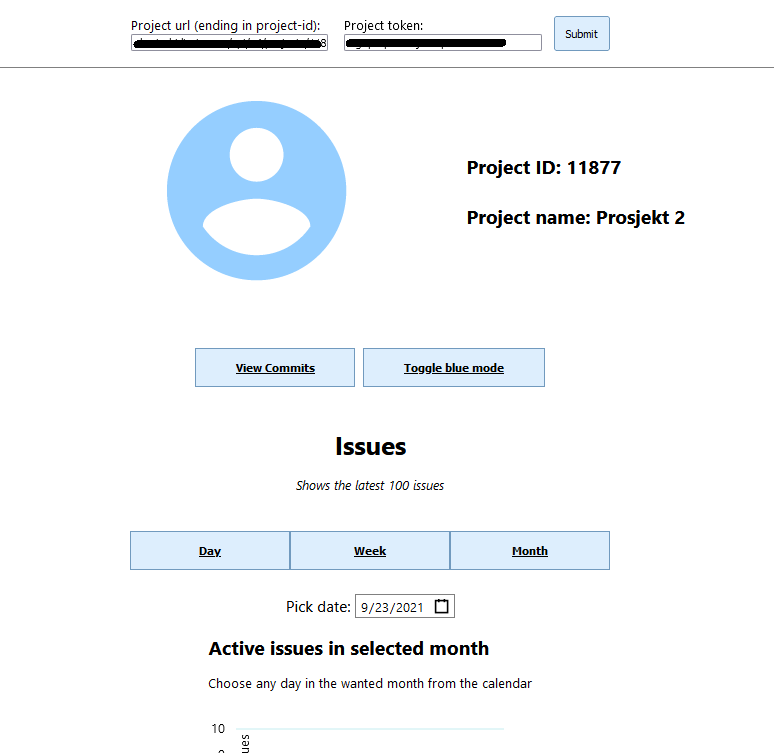
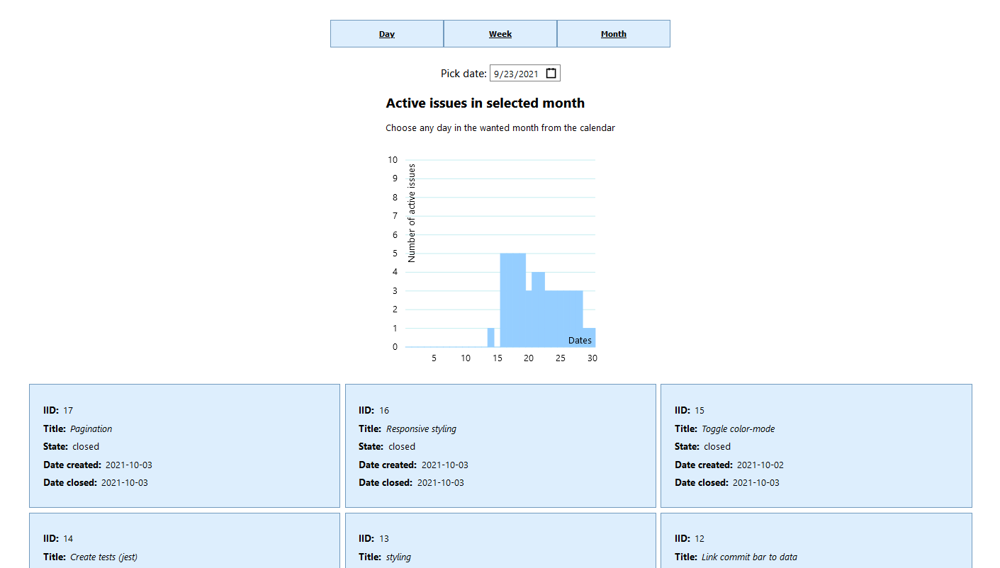
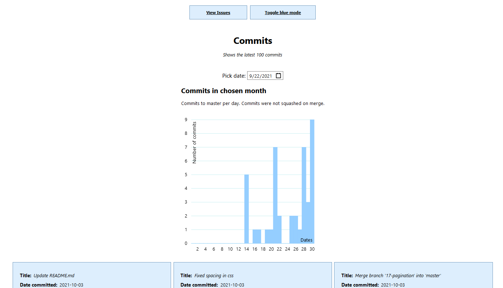

# Prosjekt 2

## Dokumentasjon
 

### Kjøring av appen
 

Appen finnes på <http://it2810-30.idi.ntnu.no/>

Bruk NTNU VPN dersom du ikke er koblet til NTNU sitt nett.

Start

1\. åpne IDE på plassering der du ønsker å jobbe lokalt

2\. klon fra gitlab

2.5 OBS: Pass på at du befinner deg i /prosjekt-2/prosjekt2 - mappen før du kjører de neste kommandoene

3\. npm install

4\. npm start

## Bilder

## Teknologi

### React

Løsningene er basert på React, Node.js og TypeScript. Brukergrensesnittet er basert på React. Vi erfarte at TypeScript gjør det lettere å lese og feilsøke. TypeScript gjør også koden lettere å forstå. TypeScript gjør kodeprosessen mye smidigere sammenlignet med JavaScript fordi TypeScript hjelper oss med å finne og unngå bugs. Det er brukt tsx for komponenter der vi anvender jsx elemeter, som er nesten alle. Vi har hovedsakelig tatt i bruk const elementer eller funksjoner i komponentene, ettersom det er enklere, og noen komponenter er bare hooks. Disse kan ikke være noe annet en en const eller variabel.

### Class, state og props

Class er brukt i toggleColor der den renderer og returnerer xml-kode til en knapp, som ved klikk bytter farge på webapplikasjonens bakgrunnsfarge. Dette har vi implementert fordi vi i hovedsak har brukt funksjoner og hooks i resten av applikasjonen, og ville vise at vi også kunne bruke class. :)

Props er brukt i dayIssues, weekIssues og monthIssues da det tar inn service.payloaden fra gitlab fra et foreldre komponent. Ettersom de tre komponentene ska anvende samme data, men behandle det annerledes, så vi det nyttig å anvende props til dette. State er brukt til håndtering av variabler innad i komponenter. Vi har sett det nyttig når vi har trengt å kunne oppdatere en variabel underveis.

### React-vis

React-vis biblioteket er brukt for å presentere gitlab data. Vi har valgt å bruke react-vis fordi det inneholder et stort sett med grunnleggende byggeklosser for forskjellige typer diagrammer. Dette gjør det mulig å enklere visualisere data. Datovelger er laget ved hjelp av react sin react-date-picker. Context API har blitt brukt til Datepicker fordi den setter dato for 3 forskjellige komponenter i koden. Context gir oss enkelt muligheten til å dele verdier mellom komponentene uten å eksplisitt måtte sende det gjennom flere nivåer.

### Ajax

Ajax FetchAPI er brukt til å aksessere Gitlabs RestAPI. Fetch er brukt fremfor den eldre XMLHttpRequest fordi det gjør koden mer lesbar og den er bra tilpasset asynkron utføring av kode. Fetch API er bare laget for ES6, men nå er de fleste nettlesere oppdatert til å bruke ES6, så vi valgte likevel å bruke den.

### Lagring

DateContext bruker sessionStorage til å lagre en valgt dag fra et DatePicker input-element. På denne måten vil data som presenteres i grafen lagres hvis siden refreshes. Det er en kjent bug med sessionStorage, som tar inn riktig Date objekt og gir det korrekt til barna. Verdien er satt som valgt dag ved midnatt. Når verdien skal lagres til storage, må den gjøres om til string og Date sin innebygde toISOString() funksjon er basert på GMT. Vi befinner oss i GMT+2, så hver dato som velges og endres til string vil gå fra GMT+2 til GMT som da er to timer bak. Med andre ord, fra 00:00 valgt dag til 22:00 dagen før. Dette gjør at dagen før den valgte lagres i sessionStorage. Det er foreløpig ikke funnet en løsning på denne buggen.

InputContext bruker localStorage til å lagre input fra tekstfelt som brukeren skriver inn. Teksten lagres i localStorage på 'Submit'. Disse tekstfeltene er til prosjekt url/path og til prosjektets access token. Dette blir lagret lokalt for lettere å få tilgang til repoet og utfylle siden med info. Ved reload eller lukking og reåpning av fanen vil det som er lagret lokalt vises i input-feltene, slik at det er lett for brukeren å igjen trykke 'Submit' og få tilgang, uten å måtte finne linken eller token på nytt. Det er mulig å endre teksten i input-feltene og da vil de nye tekst-strengene bli lagret i localStorage på 'Submit'.

### Innhold og funksjonalitet

Brukeren kan velge mellom å se på enten commits eller issues. Etter man har interagert med knappen, blir det generert et søylediagram. Brukeren kan deretter velge ønsket dato. Avhengig av om man har valgt å se på commits eller issues, vil det være ulik interaksjon med søylediagrammet. Om man velger issues, vil det være 3 knapper der man kan velge dag, uke eller måned. Om man velger commits, kan man velge bare måned. Under grafene får man i tillegg opp et grid-system, kodet med CSS Grid, som visualiserer enten commits eller issues. I gridsystemet får man informasjon om ID, tittel, tilstand, dato når det er opprettet og lukket om man har valgt 'vis issues'. Om man har valgt 'vis commits' får man informasjon om tittel og dato for commit.

Appen har en input div som inneholder felt der man kan skrive inn prosjekt url og prosjekt token. Disse feltene er også 'fixed' på siden, slik at de alltid er tilgjengelige uansett hvor på siden man har scrollet til. Prosjektinfo finner man øverst på siden med ID og prosjektnavn, med et tilhørende favicon implementert ved hjelp av SVG. Viewbox-attributet er brukt til å skalere SVG.Viewport er brukt til å skalere siden til enhetens skjermstørrelse. CSS Flexbox er brukt til å utforme nettsiden og plassere side-elementene. Dette fungerer også fint med bruk av media-queries og vi oppnår en fleksibel og responsiv layout. React-vis sin FlexibleWidthXYPlot-funksjon skalerer grafene.

## Kodetesting

Testingen er gjort med ts-jest i kombinasjon med babel og react-test-renderer. Testene kjøres med npm t. 

Ved feil ved kjøring av test med npm t, sikre at følgende kommandoer er kjørt i terminal:

-   npm i -D jest typescript

-   npm i react-test-renderer

Og sikre at package.json i node-modules til prosjekt-2/prosjekt2/node_modules/jest har "jest": "26.6.0".

### Snapshot av:

-   dayIssues. Sjekker at elementet laster når service ikke er loaded.

-   weekIssues. Sjekker at elementet laster når service ikke er loaded.

-   visCommits. Sjekker at elementet laster når service ikke er loaded.

-   Issues. Sjekker at elementet laster når service ikke er loaded.

Vi skulle gjerne ha hatt snapshots av komponenter når service var loaded, men med mangelfull kompetanse innenfor hvordan håndtere service når vi setter det gjennom en context, valgte vi heller å skrive snapshots til ufullstendige komponenter. 

Tester async fetch gjennom en mock funksjon. Skal sjekke at async fetch funker som forventet.

Vi har testet funksjonalitet for følgende funksjoner: 

-   getDaysInMonth

-   dateBool

-   isActiveInMonth

-   isActiveOnDay

En god del av filene er vanskelig å teste med den kapasiteten vi har nå, derfor har vi valgt å legge opp til testing av elementer slik at vi for kjørt og skrevet testene i steden for å legge kompetansenivået for høyt. Med det test rammeverket vi har fått satt opp nå så er det ikke mulig å kjøre en full test av appen, det krever tilrettelegging for WebStorage, som falt utenfor tidsprioriteringen for prosjektet. Til en annen gang vil vi gjerne ønske mer tid til testingen, og fokusert på denne tidligere i prosjektet.

Det er kjent feil i testen med innføring av FlexibleXYPlot i dayIssue og weekIssue tester. Når testene ble skrevet arbeidet de med XYPlot taggen, og testene oppførte seg som normalt. Innføringen av FlexibleXYPlot kom sent i utviklingen, og vi fikk ikke til å løse feilen før fristen. 

### Cross-browser testing

Cross-browser testing har blitt utført ved å se hvordan siden fungerer i nettleserne Google Chrome, Mozilla Firefox. Testing ble også utført med Iphone X (både vertikal og horisontal orientering) og iPad. Denne testingen ble utført ved hjelp av device toolbar som er i tidligere nevnte nettlesere. Det ble testet for lik oppførsel og riktig skalering. Testingen i seg selv ble utført ved at alle 3 på gruppen testet på sin egen maskin og rapporterte avvik som ble oppdaget.

## Bruk av ressurser

### React / Typescript:
https://www.youtube.com/watch?v=jrKcJxF0lAU
https://www.youtube.com/watch?v=0LsMC3ZiXkA
https://reactjsexample.com/usetgl-a-react-hook-toggle-component-visibility/
https://reactjs.org/docs/context.html#api
https://reactgo.com/react-get-input-value/
https://www.kindacode.com/article/react-typescript-handling-input-onchange-event/
https://stackoverflow.com/questions/37978528/typescript-type-string-is-not-assignable-to-type
https://stackoverflow.com/questions/41030361/how-to-update-react-context-from-inside-a-child-component
https://www.wisdomgeek.com/development/web-development/react/react-hooks-and-local-storage-lets-build-a-todo-app/
https://reactjs.org/docs/test-renderer.html 
https://reactnative.dev/docs/tutorial 
https://reactjs.org/docs/state-and-lifecycle.html 
https://reactjs.org/docs/components-and-props.html 
https://blog.logrocket.com/how-to-use-svgs-in-react/ 
https://reactjs.org/docs/hooks-state.html 
https://uber.github.io/react-vis/ 
https://reactjs.org/docs/context.html 
https://felixgerschau.com/react-typescript-context/ 
https://www.youtube.com/watch?v=5LrDIWkK_Bc 
https://reactjs.org/docs/hooks-custom.html#extracting-a-custom-hook 
https://www.tutorialsteacher.com/typescript/for-loop 
https://www.tutorialrepublic.com/html-tutorial/html5-web-storage.php 
https://bestofreactjs.com/repo/wojtekmaj-react-date-picker-react-date-time-picker 
https://www.npmjs.com/package/react-date-picker 
https://stackoverflow.com/questions/5210376/how-to-get-first-and-last-day-of-the-current-week-in-javascript 
https://stackoverflow.com/questions/66343243/how-can-i-toggle-between-3-components-in-reactjs 

### Storage:
https://www.sanwebe.com/snippet/using-html5-local-storage-to-store-input-data-and-retrieving

### RestAPI calls / FetchAPI:
https://www.sohamkamani.com/typescript/rest-http-api-call/
https://www.freecodecamp.org/news/fetch-data-react/
https://docs.gitlab.com/ee/administration/environment_variables.html
https://www.educba.com/typescript-http-request/
https://docs.gitlab.com/ee/api/api_resources.html#project-resources
https://dev.to/camilomejia/fetch-data-with-react-hooks-and-typescript-390c
https://typeofnan.dev/fix-cannot-read-property-map-of-undefined-error-in-react/

### Jest:
https://www.npmjs.com/package/ts-jest
https://kulshekhar.github.io/ts-jest/docs/guides/test-helpers/ 
https://jestjs.io/docs/getting-started#using-typescript 
https://stackoverflow.com/questions/55405540/referenceerror-react-not-defined-in-tests 
https://stackoverflow.com/questions/51902844/node-modules-types-react-index-has-no-default-export/55479609 
https://stackoverflow.com/questions/51038522/how-to-import-scss-file-as-variable-in-react-with-typescript 
https://stackoverflow.com/questions/35470511/setting-up-tsconfig-with-spec-test-folder 
https://www.npmjs.com/package/jest/v/27.0.0 
https://www.npmjs.com/package/@testing-library/dom 
https://www.npmjs.com/package/jest-css-modules 
https://www.npmjs.com/package/react-test-renderer 
https://stackoverflow.com/questions/63005011/support-for-the-experimental-syntax-jsx-isnt-currently-enabled 
https://github.com/testing-library/user-event 
https://github.com/babel/babel/tree/master/packages/babel-preset-react 
https://github.com/babel/babel/tree/master/packages/babel-plugin-syntax-jsx 
https://www.manuel-schoebel.com/blog/jest-unit-snapshot-testing-typescript-nextjs 
https://jestjs.io/docs/asynchronous 

